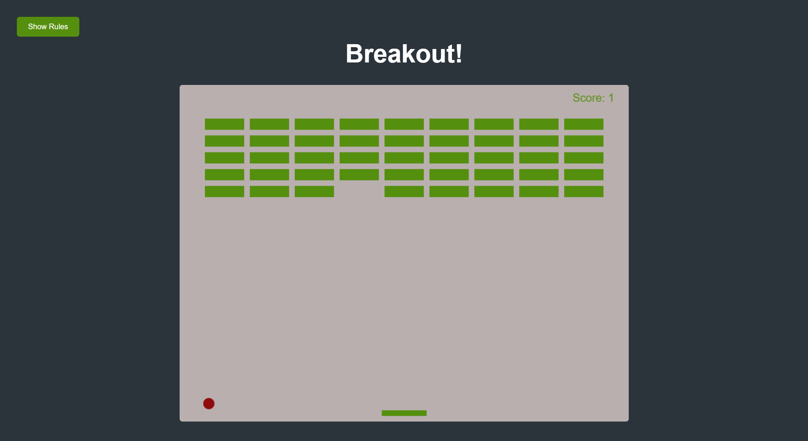

# Brick Breaker Game

A simple and fun Brick Breaker game where you control a paddle with the arrow keys to bounce a ball up to break bricks. This game is built using the HTML5 canvas element and API.

Check out the live demo [here](https://sharmaasahill.github.io/brick-breaker/)



## Features

- Draw elements on canvas
- Use canvas paths to draw shapes
- Move paddle on arrow key press
- Add collision detection
- Keep score
- Add rules button with slider

## How to Play

1. Use the left and right arrow keys to move the paddle.
2. Bounce the ball off the paddle to hit and break the bricks.
3. Keep the ball from falling off the bottom of the screen.
4. Break all the bricks to win the game.

## Setup

1. Clone the repository:
   ```sh
   git clone https://github.com/sharmaasahill/brick-breaker
   ```
2. Navigate to the project directory:
   ```sh
   cd Brick Breaker-game
   ```
3. Open `index.html` in your web browser to start playing.

## Technologies Used

- HTML5 Canvas
- JavaScript

## Learning Outcomes

By working on this project, you will learn how to:
- Draw elements on the canvas.
- Use canvas paths to create shapes.
- Handle keyboard input for paddle movement.
- Detect collisions between the ball, paddle, and bricks.
- Keep track of and display the player's score.
- Add interactive UI elements like a rules button with a slider.

## License

This project is open-source and available under the MIT License.
